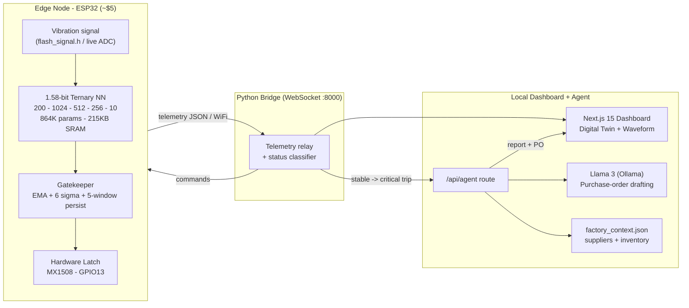

<div align="center">

# NEURAL-SHIELD

### Edge AI Predictive Maintenance for Legacy Industrial Machinery

A self-contained neural network running on a five-dollar microcontroller that listens to a machine's vibration, learns its healthy signature on-device, and physically cuts power in **4 milliseconds** when a catastrophic fault is detected — no cloud, no internet round-trip, no latency.


</div>

---

## The Problem

> Factories worldwide rely on older, heavy machinery. Replacing it costs millions, but when it breaks down unexpectedly it shuts down the **entire production line**.

The standard fix is cloud monitoring — stream sensor data up, run analytics, send a command back. But **the internet is too slow for physics**. When a gear slips or a bearing seizes, the failure cascades in milliseconds. Waiting for a packet to reach a cloud server and a shut-down signal to return takes hundreds of milliseconds to seconds. By then the machine is already destroyed.

| Approach | Detect-to-Stop Latency | Survives Internet Outage | Cost per Node |
|----------|------------------------|--------------------------|---------------|
| Cloud monitoring | 200 ms – 2 s+ | No | $$$ (gateway + subscription) |
| Manual inspection | Hours – days | Yes | Labor |
| **NEURAL-SHIELD (this project)** | **~4 ms** | **Yes** | **~$5 (ESP32)** |

---

## The Solution

NEURAL-SHIELD does not replace the old machine — it gives it a **fast, local brain**. A 1.58-bit ternary neural network is compressed to fit entirely in the SRAM of a commodity ESP32. The chip:

1. **Listens** to the motor for a few seconds and learns its unique healthy vibration distribution (auto-calibration).
2. **Predicts** the next vibration window with the on-device neural net and measures prediction error (MSE) against reality.
3. **Acts locally** — when the error crosses a statistically-derived critical threshold and persists, a hardware latch severs motor power directly. No network in the loop.
4. **Automates recovery** — the instant the machine stops, an autonomous Llama-3 agent drafts the fault report, identifies the failed bearing, and writes a purchase order to the nearest supplier.

### Three operational states

| State | Trigger | Motor | Indicator | Production |
|-------|---------|-------|-----------|------------|
| **Stable** | MSE within baseline | Spinning | Off | Running |
| **Warning** | MSE > mean + 3σ | Spinning | Flashing 5 Hz | Running (alert floor manager) |
| **Critical** | MSE > mean + 6σ, 5 windows | **Power cut → coast to stop** | Solid on | Halted + agent dispatched |

The warning state deliberately keeps the machine running — a minor hiccup should not halt production. Only a confirmed structural failure trips the latch.

---

## Architecture



### Data flow

```
[ Motor vibration ]
        |
        v
[ ESP32: ternary inference -> MSE ]  <-- runs in ~4 ms, fully offline
        |
        +--> threshold crossed + persists --> [ HARDWARE LATCH cuts power ]
        |
        v  (telemetry over WiFi, non-blocking)
[ Python bridge :8000 ] --> [ Next.js dashboard ]
        |
        +--> on stable->critical --> [ /api/agent -> Llama 3 -> Purchase Order ]
```

The critical safety path (vibration → inference → latch) is **entirely on-chip**. The bridge, dashboard, and agent are observability and logistics — if the network dies, the machine is still protected.

---

## Algorithm & Method

### 1.58-bit Ternary Neural Network

Standard neural networks store weights as 32-bit floats — far too large for a microcontroller's SRAM. NEURAL-SHIELD trains a **ternary** network where every weight is constrained to one of three values: **{ -1, 0, +1 }**. This is the "1.58-bit" regime (log₂3 ≈ 1.58 bits/weight).

- **Architecture:** `200 → 1024 → 512 → 256 → 10` fully-connected, GELU activations (`training/train_predictor.py`).
- **Task:** sequence-to-sequence forecasting — read the last 200 vibration samples, predict the next 10.
- **Parameters:** ~864K. Packed at 2 bits/weight → **~215 KB**, small enough to live in ESP32 SRAM/flash.
- **Inference:** ternary weights turn every multiply into an add, subtract, or skip — no floating-point matrix multiply. This is what makes a full forward pass feasible in milliseconds on a 240 MHz core (`firmware/main/main.ino: ternaryDense()`).

### Anomaly detection: prediction error, not a classifier

The network never sees a "broken" machine during training — it only learns to forecast a **healthy** motor's vibration (CWRU normal baseline). At runtime:

```
MSE = mean( (actual_window - predicted_window)^2 )
```

A healthy machine is predictable → low MSE. A failing machine deviates from its learned signature → MSE spikes. This is unsupervised: it generalizes to fault modes never seen in training.

### Four-pillar industrial gatekeeper (false-alarm suppression)

Raw MSE is noisy. Tripping on a single spike would halt production constantly. NEURAL-SHIELD layers four defenses (`firmware/main/main.ino: processWindow()`):

1. **Auto-calibration** — on boot, a 5-second warm-up learns this specific motor's MSE mean and σ. Thresholds are set at `mean + 3σ` (warning) and `mean + 6σ` (critical). No magic numbers; every machine self-tunes.
2. **EMA smoother** — exponential moving average (α = 0.15) filters transient noise out of the MSE stream.
3. **Persistence gatekeeper** — critical requires the smoothed MSE to exceed the threshold for **5 consecutive windows**, not one. A lone glitch cannot stop the line.
4. **Hardware latch** — once a fault is confirmed, the state latches and only clears on physical reset (or a deliberate supervisor override). The motor cannot oscillate back on.

### Autonomous logistics agent

On a stable→critical transition the bridge fires `/api/agent`, which feeds the live fault + factory context (`data/factory_context.json`) to a local **Llama 3** (via Ollama) and returns a drafted report, the identified failed bearing, a vendor decision, and lead time. A deterministic fallback guarantees a valid purchase order even if the LLM is offline.

---

## Hardware Required

| Component | Purpose | Notes |
|-----------|---------|-------|
| **ESP32 DevKit (38-pin)** | Edge inference node | ~$5. 240 MHz dual-core, 520 KB SRAM, WiFi. The "brain". |
| **MX1508 dual H-bridge** | Motor power switching | Channel A drives the spindle; `IN1 → GPIO13`, `IN2 → GND`. |
| **DC spindle motor (12 V)** | The machine under protection | Stands in for industrial machinery. |
| **Onboard LED (GPIO2)** | Status indicator | Off / flash / solid for stable / warning / critical. No external lamp. |
| **12 V power supply / battery** | Motor rail | Feeds the MX1508 `+/-`. |
| **Buck converter (12 V → 5 V)** | ESP32 supply | Or power the ESP32 from USB. |
| **Common ground** | Signal integrity | MX1508 `-` ↔ ESP32 `GND` ↔ buck `OUT-` must share one ground node. |

### Wiring summary

```
12V Battery (+) ---------------------> MX1508 +
12V Battery (-) ---------------------> MX1508 -  ---+
Buck OUT+ (5V)  ---------------------> ESP32 VIN    |  (shared ground)
Buck OUT-       ---------------------> ESP32 GND ---+
ESP32 GPIO13    ---------------------> MX1508 IN1
                                       MX1508 IN2 -> GND
MX1508 OUT1/OUT2 --------------------> Spindle Motor
ESP32 GPIO2 (onboard LED)              status indicator (no wiring needed)
```

---

## Repository Layout

```
machine/
├── app/                      Next.js 15 dashboard (App Router, React 19)
│   ├── page.tsx              Physical Digital Twin, waveform, agent terminal
│   ├── globals.css           "bf-" namespaced animation system
│   └── api/agent/route.ts    Llama-3 logistics webhook + deterministic fallback
├── backend/
│   ├── bridge.py             WebSocket relay (:8000), status classifier, agent trigger
│   └── requirements.txt
├── firmware/main/
│   ├── main.ino              ESP32 firmware: inference, gatekeeper, hardware latch
│   ├── flash_signal.h        CWRU normal vibration baseline (PROGMEM)
│   └── ternary_weights.h     Packed 1.58-bit network weights
├── training/
│   ├── train_predictor.py    Trains the ternary forecaster, exports the C header
│   └── test_local.py
├── data/
│   ├── factory_context.json  Plant, inventory, supplier database (agent context)
│   └── cwru_normal/          Raw CWRU .mat datasets (gitignored — see below)
└── artifacts/                Trained checkpoints + history (large .pt gitignored)
```

---

## Running the System

### 1. Dashboard (Next.js)

```bash
npm install
npm run dev          # http://localhost:3000
```

### 2. Bridge (Python)

```bash
pip install -r backend/requirements.txt
python backend/bridge.py        # WebSocket server on :8000
```

### 3. Autonomous agent (optional, local LLM)

```bash
ollama pull llama3
ollama serve                    # the /api/agent route calls 127.0.0.1:11434
```

### 4. Firmware (ESP32)

Open `firmware/main/main.ino` in the Arduino IDE. Install the **arduinoWebSockets** library (Markus Sattler). Set `WIFI_SSID`/`WIFI_PASS` and `BRIDGE_HOST` to your bridge machine's IP, then flash.

---

## Reproducing the Model & Datasets

The large binaries are **gitignored** to keep the repo lean — both are reproducible:

- **Raw vibration data** (`data/cwru_normal/*.mat`): download from the [Case Western Reserve University Bearing Data Center](https://engineering.case.edu/bearingdatacenter).
- **Model checkpoints** (`*.pt`): regenerate with `python training/train_predictor.py`, which also re-exports `firmware/main/ternary_weights.h`.

The committed `flash_signal.h` and `ternary_weights.h` are everything the firmware needs to build and run as-is.

---

## Why It Matters

NEURAL-SHIELD takes computation that normally demands a server and shrinks it onto a five-dollar chip. The result:

- **Prevents catastrophic damage** — local reflex faster than the failure can propagate.
- **Eliminates internet dependency** — the safety loop never leaves the chip.
- **Automates repair** — from fault detection to a drafted purchase order, with no human in the critical path.

Retrofit, don't replace.

---

<div align="center">

**MIT Licensed** · Built for edge-first industrial reliability

</div>
